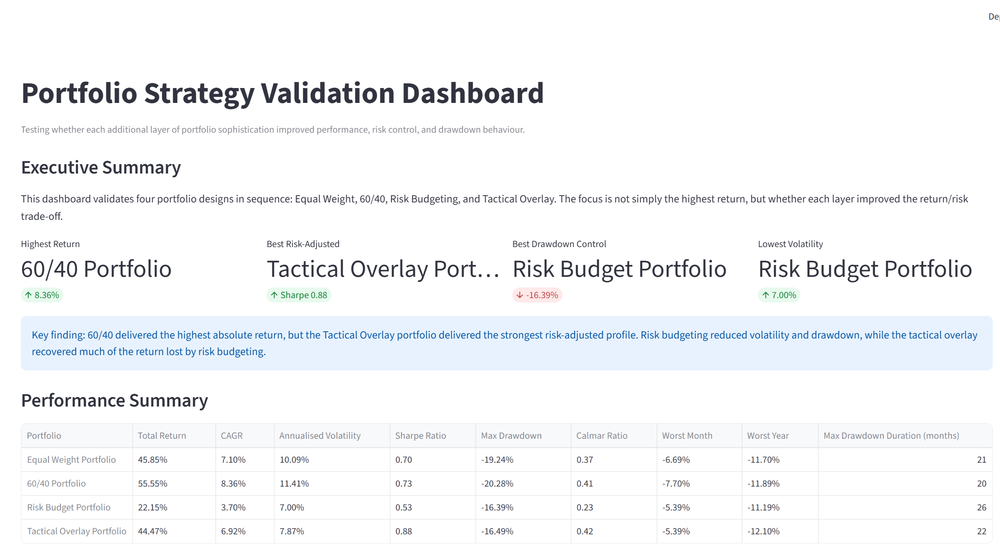
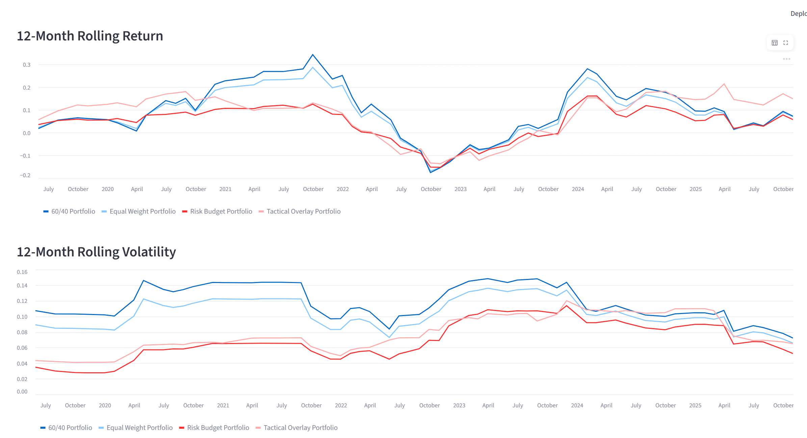
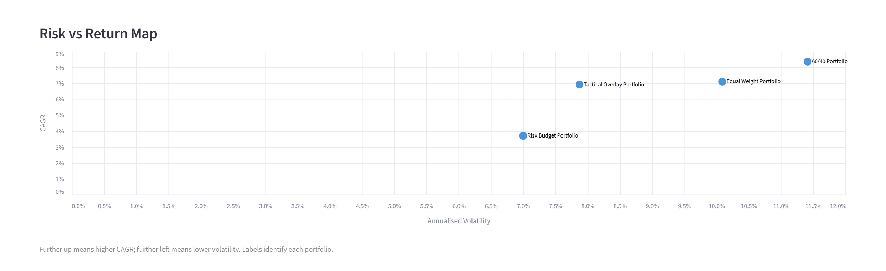
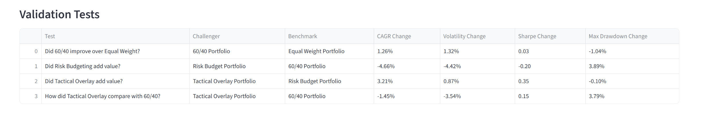
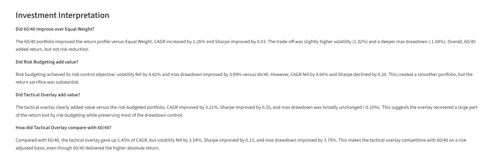

# Portfolio Strategy Validation Dashboard



## Project Overview

This project is a portfolio analytics and validation dashboard built to test whether each additional layer of portfolio sophistication actually improves investment outcomes.

The dashboard compares four portfolio strategies:

- Equal Weight Portfolio
- 60/40 Portfolio
- Risk Budget Portfolio
- Tactical Overlay Portfolio

The purpose is not simply to identify which portfolio generated the highest return. The objective is to evaluate whether each portfolio design improved the return/risk trade-off compared with the portfolio it was designed to improve.

---

## Research Problem

Portfolio strategies often become more complex over time, but additional complexity does not automatically create better investment outcomes.

This project answers a practical investment question:

> Did each additional layer of portfolio design improve performance, risk control, and risk-adjusted returns?

The analysis validates portfolio design incrementally:

```text
Equal Weight Portfolio
        ↓
60/40 Portfolio
        ↓
Risk Budget Portfolio
        ↓
Tactical Overlay Portfolio
```

---

## Portfolio Strategies Compared

### Equal Weight Portfolio

A simple benchmark portfolio with equal allocation across SPY and AGG.

**Purpose**

- Acts as a naive allocation benchmark
- Provides a simple reference point for comparison

---

### 60/40 Portfolio

A traditional allocation with 60% SPY and 40% AGG.

**Purpose**

- Represents a classic balanced portfolio
- Tests whether a conventional allocation improves on Equal Weight

---

### Risk Budget Portfolio

A dynamic portfolio built using risk contribution logic.

**Purpose**

- Allocates capital based on portfolio risk contribution
- Tests whether risk budgeting improves stability and drawdown control

---

### Tactical Overlay Portfolio

A risk-controlled portfolio that applies tactical exposure management on top of the Risk Budget Portfolio.

**Purpose**

- Uses volatility, trend, and drawdown signals
- Reduces risk exposure during weaker market conditions
- Tests whether tactical risk management improves portfolio efficiency

---

## Business / Investment Questions Answered

- Did 60/40 improve on Equal Weight?
- Did Risk Budgeting add value versus 60/40?
- Did Tactical Overlay improve on Risk Budgeting?
- How did Tactical Overlay compare with 60/40?
- Which portfolio had the best return?
- Which portfolio had the best risk-adjusted performance?
- Which portfolio controlled drawdowns most effectively?
- Was the added complexity justified?

---

## Key Findings

- The 60/40 Portfolio delivered the highest absolute return.
- The Risk Budget Portfolio reduced volatility and improved drawdown control.
- Risk Budgeting alone sacrificed a meaningful amount of return.
- The Tactical Overlay Portfolio recovered much of the return lost through risk budgeting.
- Tactical Overlay delivered the strongest Sharpe Ratio.
- Tactical Overlay became competitive with 60/40 on a risk-adjusted basis.
- The strongest evidence of value creation came from the tactical overlay layer.

---

## Dashboard Components

### Executive Summary

Provides a high-level view of the best-performing portfolios across key criteria:

- Highest Return
- Best Risk-Adjusted Performance
- Best Drawdown Control
- Lowest Volatility


---

### Performance Summary

Compares all portfolio strategies using investment performance metrics.

**Metrics Included**

- Total Return
- CAGR
- Annualised Volatility
- Sharpe Ratio
- Maximum Drawdown
- Calmar Ratio
- Worst Month
- Worst Year
- Maximum Drawdown Duration

---

### Growth of £1

Shows how £1 invested in each portfolio would have grown over time.

**Insights Provided**

- Long-term wealth creation
- Relative portfolio performance
- Comparison of return paths across strategies


---

### Rolling Return and Rolling Volatility

Tracks portfolio behaviour through time using 12-month rolling analytics.

**Insights Provided**

- Changing return profile
- Changing risk profile
- Market regime sensitivity
- Portfolio stability across time



---

### Risk vs Return Map

Plots portfolios by annualised volatility and CAGR.

**Insights Provided**

- Return/risk trade-off
- Portfolio efficiency comparison
- Visual identification of risk-controlled strategies



---

### Validation Tests

Tests each portfolio against the portfolio it was designed to improve.

**Validation Framework**

| Test | Challenger | Benchmark |
|---|---|---|
| Did 60/40 improve over Equal Weight? | 60/40 Portfolio | Equal Weight Portfolio |
| Did Risk Budgeting add value? | Risk Budget Portfolio | 60/40 Portfolio |
| Did Tactical Overlay add value? | Tactical Overlay Portfolio | Risk Budget Portfolio |
| How did Tactical Overlay compare with 60/40? | Tactical Overlay Portfolio | 60/40 Portfolio |



---

### Investment Interpretation

Converts portfolio metrics into investment conclusions.

**Interpretation Focus**

- Whether risk reduction was worth the return sacrifice
- Whether Tactical Overlay justified its added complexity
- Whether portfolio improvements were meaningful from an investment perspective



---

## Repository Structure

```text
portfolio_strategy_validation_dashboard/
│
├── README.md
├── requirements.txt
│
├── docs/
│
├── outputs/
│   ├── base_portfolio_weights.csv
│   ├── tactical_overlay_returns.csv
│   └── portfolio_strategy_comparison_returns.csv
│
├── screenshots/
│   ├── hero_dashboard.png
│   ├── growth_of_1_pound.png
│   ├── rolling_analytics.png
│   ├── risk_return_map.png
│   ├── validation_tests.png
│   └── investment_interpretation.png
│
└── scr/
    └── portfolio_strategy_validation_dashboard.py
```

---

## Data and Methodology

### Data

The dashboard uses SPY and AGG as representative equity and bond assets.

- SPY: Equity market exposure
- AGG: Aggregate bond market exposure

Historical price data is downloaded using `yfinance`.

---

### Methodology

The project follows a layered portfolio validation approach:

1. Build baseline portfolio returns.
2. Apply traditional 60/40 allocation.
3. Apply risk budgeting logic.
4. Apply tactical overlay returns.
5. Align all return streams.
6. Calculate portfolio metrics.
7. Compare portfolios incrementally.
8. Interpret whether each enhancement added value.

---

## Tools & Technologies

- Python
- Streamlit
- Pandas
- NumPy
- Altair
- yFinance

---

## How to Run the Project

### 1. Clone the Repository

```bash
git clone https://github.com/YOUR-USERNAME/portfolio_strategy_validation_dashboard.git
cd portfolio_strategy_validation_dashboard
```

### 2. Install Requirements

```bash
pip install -r requirements.txt
```

### 3. Run the Streamlit App

```bash
streamlit run scr/portfolio_strategy_validation_dashboard.py
```

---

## Skills Demonstrated

- Portfolio Analytics
- Risk Management
- Tactical Asset Allocation
- Portfolio Performance Measurement
- Risk-Adjusted Return Analysis
- Drawdown Analysis
- Rolling Return and Volatility Analysis
- Streamlit Dashboard Development
- Python Data Analysis
- Investment Research Interpretation
- Financial Data Visualization

---

## Overall Conclusion

This project shows that portfolio design should be judged incrementally.

The 60/40 Portfolio improved return versus Equal Weight. Risk Budgeting improved stability but sacrificed return. The Tactical Overlay Portfolio delivered the clearest improvement relative to the layer it was designed to enhance.

In this sample, the Tactical Overlay Portfolio did not simply add complexity. It materially improved risk-adjusted performance and made the risk-controlled portfolio competitive with 60/40 on a risk-adjusted basis.

---

## Author

**Manjeet Kathuria**

MBA Finance | CFA Level II Passed

Financial Analysis • Portfolio Analytics • Python • SQL • Power BI • Investment Research
